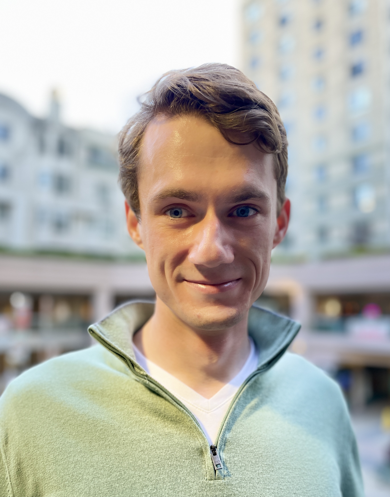

[Education](#education) -
[Publications](#publications) -
[Research](#research) -
[Professional](#professional) -
[Training](#training) -
[Code](#code) -
[Awards](#awards) -
[Talks](#talks) -

    

Doctoral Student at the [Computational Science Research Center](http://www.csrc.sdsu.edu/), San Diego State University & University of California, Irvine

## Education 

* **PhD Computational Science**, expected 2023 - University of California, Irvine & San Diego State University

* **MS Physics**, 2018 - San Diego State University

* **BA Physics**, 2016 - University of California, Berkeley

## Publications

1. **Cross sections for neutron-induced reactions from surrogate data: revisiting the Weisskopf-Ewing approximation for (n,n') and (n,2n) reactions**, O. Gorton and J. E. Escher, submitted to Phys. Rev. C. Pre-print available [arXiv:2102.03452](https://arxiv.org/abs/2102.03452).

2. **Measurements of proton capture in the A=100-110 mass region: Constraints of the 111In(gamma,p)/(gamma,n) branching point relevant to the
gamma-process**, O. Olivas-Gomez, A. Simon, O. Gorton, J. E. Escher et al., Published November 2020 [Phys. Rev. C, 102, 055806](https://journals.aps.org/prc/abstract/10.1103/PhysRevC.102.055806). 

3. **Neutron capture cross sections from surrogate reaction data and theory: connecting the pieces with a Markov-Chain Monte Carlo approach**, O. Gorton and J. E. Escher, CNR*18 Proceedings. Preprint available [arXiv:1905:03055](https://arxiv.org/abs/1905.03055). Published September 2020 [Spring Proceedings in Physics](https://doi.org/10.1007/978-3-030-58082-7_28).

4. **Efficient Modeling of Nuclei Through Coupling of Proton and Neutron Wavefunctions**, O. Gorton, Advisor: C. Johnson, [Masters Thesis (2018) San Diego State University, 2018](https://csu-sdsu.primo.exlibrisgroup.com/permalink/01CALS_SDL/r45sar/alma991023475280402917).

## Research

1. **Graduate Research Assistant**, SDSU Research Foundation with [Calvin Johnson](http://sci.sdsu.edu/johnson/), 2019 - present
    - Developed software and theory to describe atomic nuclei using the nuclear shell model and computaional science
   
2. **Glenn T. Seaborg Institute (GTSI) Summer Intern**, [Seaborg Institute, LLNL](https://seaborg.llnl.gov), Summer 2021

3. **High Energy Density Physics Intern**, [Lawrence Livermore National Laboratory](https://www.llnl.gov), Summer 2018, 2019, and 2020
    - Developed Python code to do MCMC parameter estimation for statistical nuclear reaction codes in order to combine surrogate data and theory
    - Employed code for sensitivity studies assessing approximations in the surrogate reactions method
    - Modified and ran four Hauser-Feshbach model codes

4. **Graduate Student**, UC Irvine, Department of Chemistry with [Filipp Furche](https://ffgroup.chem.uci.edu/members/filipp/), Fall 2019 and Spring 2020.
   - Collaborated to develop formalism for Nuclear-Electronic Orbital method using time-dependent density functional theory

## Professional

* Served as a referee for Physical Review C
* Experience writing proposals for DOE, NNSA, and other funding sources
* **Graduate Teaching Associate**, San Diego State Univeristy, Department of Physics, during 2016 - 2020.
   - Independently led lectures and exams for introductory-level physics lab courses
   - Modernized [the manual](https://docs.google.com/document/d/1pejqikoYhlaIMhSzBzUzrnh2hDrC_q-bEcJCeflpX7w/edit?usp=sharing) for Physics 182A/195L Laboratory for online deployment in Spring 2020

## Training

* FRIB-TA Summer School: A practical walk through formal scattering theory, 2021
   - [Course resources](https://fribtascattering.github.io)
   -  Connecting bound states, resonances, and scattering states in exotic nuclei and beyond

* Agile Development Practices and Tools: A Guided Tour, 2020
   - Sustainable Horizons Institute introduction to agile software development
   - Collaborative source control using git, GitHub, and git workflows

* Technical Writing Workshop, 2019
   - LLNL PLS Directorate sponsored two-part writing class
   - Session 1: Structuring your research paper
   - Session 2: Clear, accurate, concise writing

## Code

* Major projects: Modern Fortran, Python, Bash
* Minor tasks: C++, openMP, MPI, Mathematica, MATLAB, R

## Awards

* *Recently awarded 3-year proposal* LLNL, WCI, Academic Collaboration Team (ACT) University Program
* Graduate S-STEM Scholarship, 2018-2020

## Talks

1. **DMFortFactor: A Fast and Accessible for Computing WIMP-Nucleus-Scattering Event-Rates**, O. Gorton, C. Johnson, C. Jiao, talk given at DNP21 APS Conference (October 2021).
2. **Better MCMC for Nuclear Data using emcee and B-DJINN**, O. C. Gorton, J. E. Escher, K. O. Bergstrom, M. K. Kruse, talk given at LLNL Summer Slam 2021.
3. **Nuclear Physics for WIMPs**, O. Gorton and C. W. Johnson, talk given at SDSU SIAM Student Chapter Summer Colloquium Series,
 Friday July 2, 2021.
4. **Cross subsections for neutron reactions from surrogate measurements:  Revisiting the Weisskopf-Ewing approximation**, O. Gorton and J. E. Escher, DNP20 APS Conference (October 2020).
5. **Can we get rid of the theorists?**, O. Gorton and J. E. Escher, LLNL Summer Slam talk (August 2020).
6. **Big Picture and Background for Nuclear-Electronic Orbital (NEO) Approach: Calculating Mixed Nucleon-Electron Wave Functions**, O. Gorton, progress talk presented for the Furche Group, Chemistry Department, UC Irvine (March 2020).
7. **Indirect measurements of nuclear cross subsections: tempering experimental results with theory**, O. Gorton and J. E. Escher, HEDP Exit Talk (September 2019).
8. **Sensitivity Study of the Surrogate Method**, O. Gorton and J. E. Escher, poster presented at LLNL Student Poster Symposium (August 2019).
9. **Temperature and Entropy in the Nuclear Shell Model**, O. Gorton and C. W. Johnson, poster presented at SDSU ACCESS event (April 2019).
10. **Proton Neutron Interacting Shell Model: Order of Magnitude Reduction for Medium Mass Nuclei**, O. Gorton and C. Johnson, poster presentated at SDSU annual research symposium (March 2019).
11. **Neutron capture cross subsections from surrogate reaction data and theory: connecting the pieces with a Markov-Chain Monte Carlo approach**, O. Gorton and J. E. Escher, poster presented at [CNR*18](https://indico.bnl.gov/event/4158/),  September 2018.
12. **A Markov Chain Monte Carlo Tool for Hauser-Feshbach Codes**, O. Gorton and J.E. Escher, HEDP Exit Talk (August 2018).
