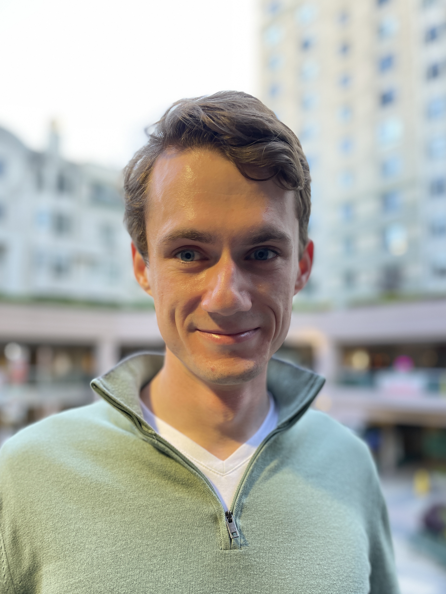

## C u r r e n t l y

Intern at the [LLNL Seaborg Institute](https://seaborg.llnl.gov)

Doctoral Student at the [Computational Science Research Center](http://www.csrc.sdsu.edu/), San Diego State University & University of California, Irvine

## E d u c a t i o n

PhD Computational Science, expected 2023 - _University of California, Irvine, Irvine, USA_ & _San Diego State University, CA, USA_

MS Physics, 2018 - _San Diego State University, CA, USA_

BA Physics, 2016 - _University of California, Berkeley, Berkeley, USA_

## P u b l i c a t i o n s

1. Cross sections for neutron-induced reactions from surrogate data: revisiting the Weisskopf-Ewing approximation for (n,n') and (n,2n) reactions, _O. Gorton and J. E. Escher, submitted to Phys. Rev. C. Pre-print available [arXiv:2102.03452](https://arxiv.org/abs/2102.03452)_.

2. Measurements of proton capture in the A=100-110 mass region: Constraints of the 111In(gamma,p)/(gamma,n) branching point relevant to the
gamma-process, _O. Olivas-Gomez, A. Simon, O. Gorton, J. E. Escher et al., Published November 2020 [Phys. Rev. C, 102, 055806](https://journals.aps.org/prc/abstract/10.1103/PhysRevC.102.055806)_

3. Neutron capture cross sections from surrogate reaction data and theory: connecting the pieces with a Markov-Chain Monte Carlo approach, _O. Gorton and J. E. Escher, CNR*18 Proceedings. Preprint available [arXiv:1905:03055](https://arxiv.org/abs/1905.03055). Published September 2020[Spring Proceedings in Physics](https://doi.org/10.1007/978-3-030-58082-7_28)_

4. Efficient Modeling of Nuclei Through Coupling of Proton and Neutron Wavefunctions, _O. Gorton, Advisor: C. Johnson, Masters Thesis (2018)_ [San Diego State University, 2018](https://csu-sdsu.primo.exlibrisgroup.com/permalink/01CALS_SDL/r45sar/alma991023475280402917)

## R e s e a r c h
1. Glenn T. Seaborg Institute (GTSI) Summer Intern

   At [Seaborg Institute, LLNL](https://seaborg.llnl.gov), Summer 2021

2. High Energy Density Physics Intern  
   
   At [Lawrence Livermore National Laboratory](https://www.llnl.gov), during
   Summer 2018, 2019, and 2020
    - Developed Python code to do MCMC parameter estimation for statistical nuclear reaction codes in order to combine surrogate data and theory
    - Employed code for sensitivity studies assessing approximations in the surrogate reactions method
    - Modified and ran four Hauser-Feshbach model codes

3. Graduate Research Assistant

   At SDSU Research Foundation with [Calvin Johnson](http://sci.sdsu.edu/johnson/), during 2019 - present
   - Developed software and theory to describe atomic nuclei using the nuclear shell model and computaional science

4. Graduate Student

   At UC Irvine, Department of Chemistry with [Filipp Furche](https://ffgroup.chem.uci.edu/members/filipp/), during Fall 2019 and Spring 2020.
   - Collaborated to develop formalism for Nuclear-Electronic Orbital method using time-dependent density functional theory

## T e a c h i n g
1. Graduate Teaching Associate

   At San Diego State Univeristy, Department of Physics, during 2016 - 2020.
   - Independently led lectures and exams for introductory-level physics lab courses
   - Modernized [the manual](https://docs.google.com/document/d/1pejqikoYhlaIMhSzBzUzrnh2hDrC_q-bEcJCeflpX7w/edit?usp=sharing) for Physics 182A/195L Laboratory for online deployment in Spring 2020

## T r a i n i n g
1. FRIB-TA Summer School: A practical walk through formal scattering theory, 2021
   - [Course resources](https://fribtascattering.github.io)
   -  Connecting bound states, resonances, and scattering states in exotic nuclei and beyond

2. Agile Development Practices and Tools: A Guided Tour, 2020
   Sustainable Horizons Institute introduction to agile software development
   - Collaborative source control using git, GitHub, and git workflows

3. Technical Writing Workshop, 2019
   LLNL PLS Directorate sponsored two-part writing class
   - Session 1: ``Structuring your research paper``
   - Session 2: ``Clear, accurate, concise writing``

## P r o g r a m m i n g
- Major projects: Modern Fortran, Python, Bash
- Minor tasks: C++, openMP, MPI, Mathematica, MATLAB, R

## A w a r d s
- Graduate S-STEM Scholarship, 2018-2020

## P r e s e n t a t i o n s
1. _Better MCMC for Nuclear Data using emcee and B-DJINN_ O. C. Gorton, J. E. Escher, K. O. Bergstrom, M. K. Kruse, talk given at LLNL Summer Slam 2021.
2. _Nuclear Physics for WIMPs_ O. Gorton and C. W. Johnson, talk given at SDSU SIAM Student Chapter Summer Colloquium Series,
 Friday July 2, 2021.
3. _Cross subsections for neutron reactions from surrogate measurements:  Revisiting the Weisskopf-Ewing approximation_ O. Gorton and J. E. Escher, DNP20 APS Conference (October 2020).
4. _Can we get rid of the theorists?_ O. Gorton and J. E. Escher, LLNL Summer Slam talk (August 2020).
5. _Big Picture and Background for Nuclear-Electronic Orbital (NEO) Approach: Calculating Mixed Nucleon-Electron Wave Functions_ O. Gorton, progress talk presented for the Furche Group, Chemistry Department, UC Irvine (March 2020).
6. _Indirect measurements of nuclear cross subsections: tempering experimental results with theory_ O. Gorton and J. E. Escher, HEDP Exit Talk (September 2019).
7. _Sensitivity Study of the Surrogate Method_ O. Gorton and J. E. Escher, poster presented at LLNL Student Poster Symposium (August 2019).
8. _Temperature and Entropy in the Nuclear Shell Model_ O. Gorton and C. W. Johnson, poster presented at SDSU ACCESS event (April 2019).
9. _Proton Neutron Interacting Shell Model: Order of Magnitude Reduction for Medium Mass Nuclei_ O. Gorton and C. Johnson, poster presentated at SDSU annual research symposium (March 2019).
10. _Neutron capture cross subsections from surrogate reaction data and theory: connecting the pieces with a Markov-Chain Monte Carlo approach_ O. Gorton and J. E. Escher, poster presented at [CNR*18](https://indico.bnl.gov/event/4158/),  September 2018.
11. _A Markov Chain Monte Carlo Tool for Hauser-Feshbach Codes_ O. Gorton and J.E. Escher, HEDP Exit Talk (August 2018).
