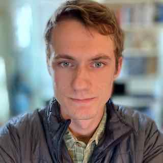

# About Oliver Gorton
 

Doctoral student  
San Diego State University 
University of California, Irvine 

## Education

#### PhD Computational Science, expected 2023

from _University of California, Irvine, Irvine, USA_ and _San Diego State University, CA, USA_

#### MS Physics, 2018

from _San Diego State University, CA, USA_

#### BA Physics, 2016

from _University of California, Berkeley, Berkeley, USA_

## Pubications

1. Cross sections for neutron-induced reactions from surrogate data: revisiting the Weisskopf-Ewing approximation for (n,n') and (n,2n) reactions, _O. Gorton and J. E. Escher, submitted to Phys. Rev. C. Pre-print available [arXiv:2102.03452](https://arxiv.org/abs/2102.03452)_.

2. Measurements of proton capture in the A=100-110 mass region: Constraints of the 111In(gamma,p)/(gamma,n) branching point relevant to the
gamma-process, _O. Olivas-Gomez, A. Simon, O. Gorton, J. E. Escher et al., Published November 2020 [Phys. Rev. C, 102, 055806](https://journals.aps.org/prc/abstract/10.1103/PhysRevC.102.055806)_

3. Neutron capture cross sections from surrogate reaction data and theory: connecting the pieces with a Markov-Chain Monte Carlo approach, _O. Gorton and J. E. Escher, CNR*18 Proceedings, Springer 2019. Preprint available [arXiv:1905:03055](https://arxiv.org/abs/1905.03055)._

4. Efficient Modeling of Nuclei Through Coupling of Proton and Neutron Wavefunctions, _O. Gorton, Advisor: C. Johnson, Masters Thesis (2018)_

## Experience

### High Energy Density Physics Intern 
At [Lawrence Livermore National Laboratory](https://www.llnl.gov), during
Summer 2018, 2019, and 2020
- Developed Python code to do MCMC parameter estimation for statistical nuclear reaction codes in order to combine surrogate data and theory
- Employed code for sensitivity studies assessing approximations in the surrogate reactions method
- Modified and ran four Hauser-Feshbach model codes

### Graduate Research Assistant
At SDSU Research Foundation with [Calvin Johnson](http://sci.sdsu.edu/johnson/), during 2019 - present
- Developed software and theory to describe atomic nuclei using the nuclear shell model and computaional science

### Graduate Student
At UC Irvine, Department of Chemistry with [Filipp Furche](https://ffgroup.chem.uci.edu/members/filipp/), during Fall 2019 and Spring 2020.
- Collaborated to develop formalism for Nuclear-Electronic Orbital method using time-dependent density functional theory

### Graduate Teaching Associate
At San Diego State Univeristy, Department of Physics, during 2016 - 2020.
- Independently led lectures and exams for introductory-level physics lab courses
- Modernized Intro Mechanics Physics Laboratory for online deployment in Spring 2020

## Training
### Technical Writing Workshop, 2019
LLNL PLS Directorate sponsored two-part writing class
- Session 1: ``Structuring your research paper"
- Session 2: ``Clear, accurate, concise writing

### Agile Development Practices and Tools: A Guided Tour, 2020
Sustainable Horizons Institute introduction to agile software development
- Collaborative source control using git, GitHub, and git workflows

## Skills and Technologies
- Major projects: Modern Fortran, Python, Bash
- Minor tasks: C++, openMP, MPI, Mathematica, MATLAB, R

## Presentations
1. ``Cross subsections for neutron reactions from surrogate measurements:  Revisiting the Weisskopf-Ewing approximation'' O. Gorton and J. E. Escher, DNP20 APS Conference (October 2020).
2. ``Can we get rid of the theorists?'' O. Gorton and J. E. Escher, LLNL Summer Slam talk (August 2020).
3. ``Big Picture and Background for Nuclear-Electronic Orbital (NEO) Approach: Calculating Mixed Nucleon-Electron Wave Functions'' O. Gorton, progress talk presented for the Furche Group, Chemistry Department, UC Irvine (March 2020).
4. ``Indirect measurements of nuclear cross subsections: tempering experimental results with theory'' O. Gorton and J. E. Escher, HEDP Exit Talk (September 2019).
5. ``Sensitivity Study of the Surrogate Method'' O. Gorton and J. E. Escher, poster presented at LLNL Student Poster Symposium (August 2019).
6. ``Temperature and Entropy in the Nuclear Shell Model'' O. Gorton and C. W. Johnson, poster presented at SDSU ACCESS event (April 2019).
7. ``Proton Neutron Interacting Shell Model: Order of Magnitude Reduction for Medium Mass Nuclei'' O. Gorton and C. Johnson, poster presentated at SDSU annual research symposium (March 2019).
8. ``Neutron capture cross subsections from surrogate reaction data and theory: connecting the pieces with a Markov-Chain Monte Carlo approach'' {O. Gorton} and J. E. Escher, poster presented at [CNR*18](https://indico.bnl.gov/event/4158/),  September 2018.
9. ``A Markov Chain Monte Carlo Tool for Hauser-Feshbach Codes'' O. Gorton and J.E. Escher, HEDP Exit Talk (August 2018).
