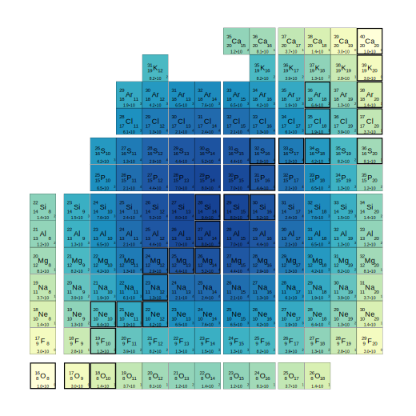
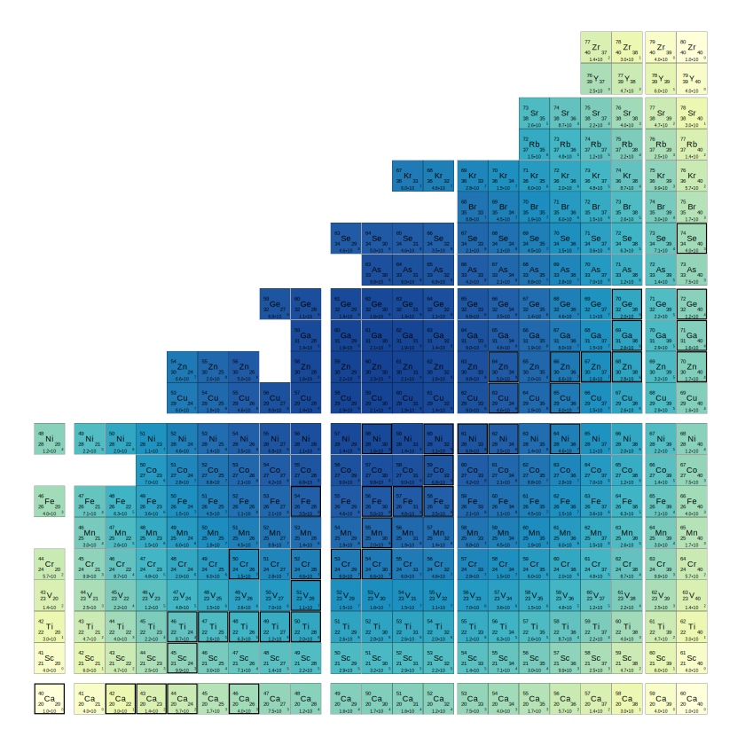
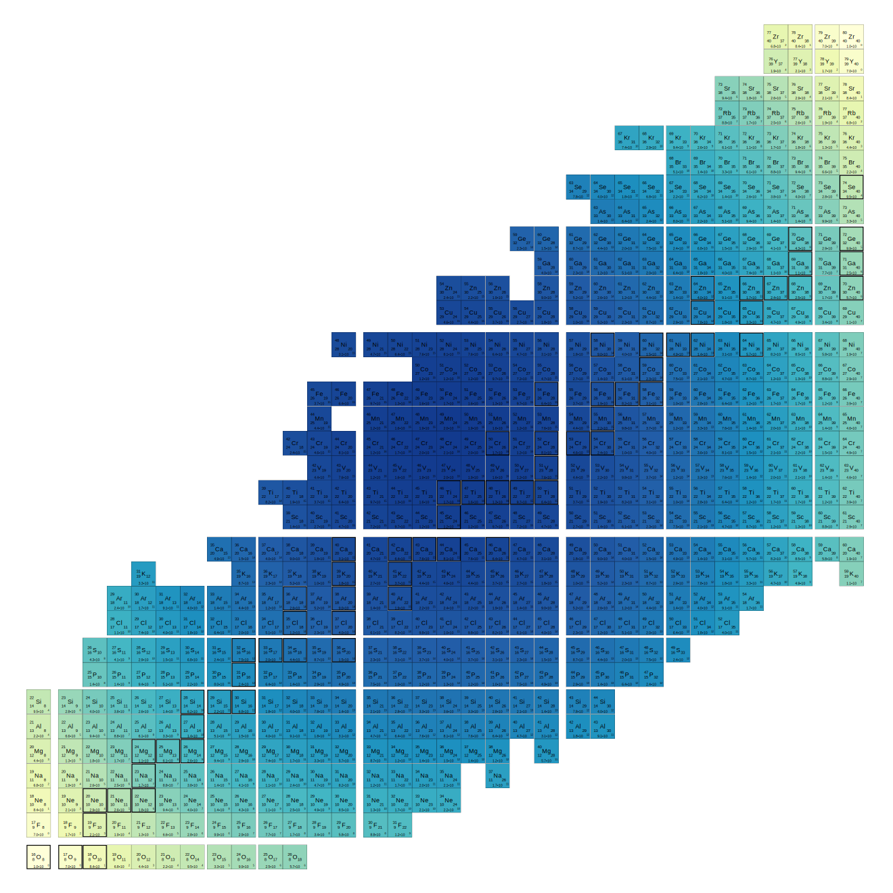
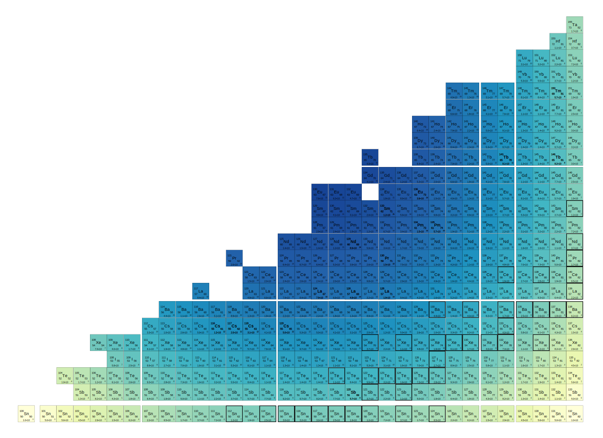
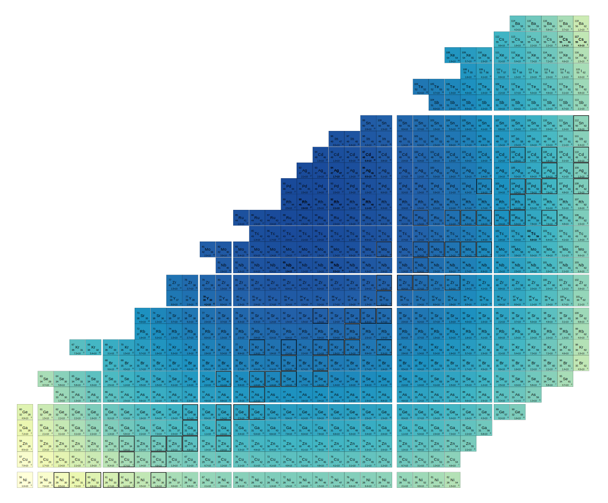

# Shell model dimensions

by [Oliver Gorton](index.html)

These figures show the dimensions of M-scheme shell model calculations in
various valence spaces. Dimensions were computed with the
[BIGSTICK](https://github.com/cwjsdsu/BigstickPublick) shell model code.
Figures were generated with a Python script that writes gnuplot code.  In
spaces with both parities, dimenions include both.

Jump to: [sd](#sd), [pf](#pf), [sdpf](#sdpf), [pfg](#pfg), [gcn](#gcn), [glepn](#glepn)

Gaps in the chart indicate magic numbers according to the conventional shell model:

The edges of the chart are given by the intersection of the model space (a
rectangular region) and the drip line according to the NNDC. The squares with a
thicker border are the stable isotopes.

Your browser probably allows you to open these images in a new tab, window, or to download the (.svg) file for better viewing.

## sd
*sd* shell model (1d5/2, 2s1/2, 1d3/2)

Core: O-16 (8, 8)

## pf

*pf* shell model (1f7/2, 2p3/2, 1f5.2, 2p1/2)

Core: Ca-40 (20, 20)

## sdpf

*sd-pf* shell model (1d5/2, 2s1/2, 1d3/2, 1f7/2, 2p3/2, 1f5.2, 2p1/2)

Core: O-16 (8, 8)

## pfg

*pfg* shell model (2p3/2, 1f5/2, 2p1/2, 1g9/2)

Core: Ni-56 (28, 28)

## gcn

*dghsd* shell model (2d5/2, 1g7/2, 1h11/2, 3s1/2, 2d3/2)

Core: Sn-100 (50,50)

## glepn

*fp-sd* shell model (2p3/2, 1f5/2, 2p1/2, 1g9/2, 2d5/2, 3s1/2, 2d3/2)

Core: Ni-56 (28,28)

